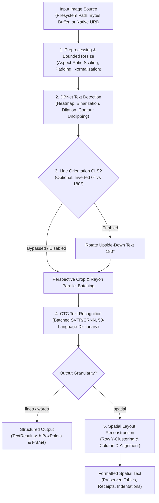

::project-badges
::

**RustO!** is a high-performance Optical Character Recognition (OCR) engine and cross-platform toolkit written in pure Rust. Based on [RapidOCR](https://github.com/RapidAI/RapidOCR) and powered by [PaddleOCR](https://github.com/PaddlePaddle/PaddleOCR) deep learning models with Alibaba's [MNN](https://github.com/alibaba/MNN) lightweight inference backend, RustO! delivers sub-second inference speeds, ultra-low memory overhead, zero OpenCV runtime dependencies, and **99.3%+ accuracy parity** with native C++ OpenCV implementations.

## 🎯 Architecture Pipeline

RustO! orchestrates an end-to-end OCR and layout analysis pipeline optimized for edge devices and high-throughput servers:

---

## ⚡ Key Highlights & Advantages

- **🚀 100% Pure Rust Core**: Zero OpenCV runtime dependency. Binarization, contour tracing, polygon clipping, and affine transformations are implemented in memory-safe Rust with SIMD acceleration.
- **📦 Ultra-Small Footprint**: Core binaries are ~5 MB (self-contained) compared to 50+ MB for traditional OpenCV + ONNX runtime stacks.
- **📄 Human-Readable Spatial Layouts**: Native support for reconstructing invoices, receipts, multi-column tables, and forms directly into visually formatted text.
- **🧠 Comprehensive Model Ecosystem**: Out-of-the-box support for **PP-OCRv6** (Tiny, Small, Medium), **PP-OCRv5** (Mobile, Server), and **PP-OCRv4** (Mobile, Server) architectures.
- **🌐 50+ Languages in One Model**: PP-OCRv6 uses a unified dictionary supporting Latin, Cyrillic, CJK, Devanagari, Arabic, and more simultaneously.
- **📱 Universal Multi-Platform SDKs**: First-class support for **Rust**, **.NET / C#**, **React Native**, **iOS (Swift)**, **Android (Kotlin)**, and **C FFI**.

---

## 📦 Supported Platforms & Ecosystem

| Platform         | Target Package / Registry                                                                     | Support Matrix                                           |
| ---------------- | --------------------------------------------------------------------------------------------- | -------------------------------------------------------- |
| **Rust**         | `cargo add rusto-rs` ([crates.io](https://crates.io/crates/rusto-rs))                         | Linux, macOS, Windows, Android (NDK), iOS                |
| **.NET / C#**    | `dotnet add package RustODotnet` ([NuGet](https://www.nuget.org/packages/RustODotnet))        | .NET 6.0+, .NET 8.0+, .NET Standard 2.0+ (Win/Mac/Linux) |
| **React Native** | `npm install react-native-rusto` ([npm](https://www.npmjs.com/package/react-native-rusto))    | React Native 0.70+ (New Arch & Paper), Expo              |
| **iOS**          | `pod 'RustO'` ([CocoaPods](https://cocoapods.org/pods/RustO))                                 | iOS 13.0+, Mac Catalyst (arm64, x86_64)                  |
| **Android**      | `com.github.byrizki.rusto-rs:rusto-android` ([JitPack](https://jitpack.io/#byrizki/rusto-rs)) | Android API 21+ (ARM64-v8a, ARMv7a, x86_64, x86)         |
| **C / Native**   | `librusto.so` / `librusto.dylib` / `rusto.dll`                                                | C99 / C++11 and any language with C FFI bindings         |
| **CLI**          | `rusto` binary                                                                                | Standalone command-line tool for desktop & CI pipelines  |

---

## 📊 Performance & Parity Comparison

Benchmarks conducted on standard document scans (A4 invoice, 150 DPI) on an AMD Ryzen 7 / Apple M-series CPU:

| Metric                | RustO! (Pure Rust + MNN)      | Traditional OpenCV + C++ Pipeline | Advantage                   |
| --------------------- | ----------------------------- | --------------------------------- | --------------------------- |
| **Detection Speed**   | **~80 ms**                    | ~85 ms                            | ⚡ **6% faster**            |
| **Recognition Speed** | **~120 ms**                   | ~125 ms                           | ⚡ **4% faster**            |
| **Accuracy Parity**   | **99.3%+**                    | Baseline (100%)                   | 🎯 Identical bounding boxes |
| **Binary Footprint**  | **~5 MB**                     | ~55 MB+ (libopencv, onnxruntime)  | 📦 **90% reduction**        |
| **Peak Memory (RAM)** | **~120 MB**                   | ~260 MB+                          | 🔒 **54% lower memory**     |
| **Safety**            | Memory-safe (Rust guarantees) | Manual pointers / potential leaks | 🛡️ Zero memory bugs         |

---

## Next Steps

- [Installation Guide](./2.installation.md) — Set up RustO! on your preferred platform.
- [Quick Start Tutorial](./3.quick-start.md) — Run your first OCR scan in under 5 minutes.
- [How-To Guides](../02.how-to/00.use-rust.md) — Deep-dive tutorials for each programming language.
- [API Reference](../04.api-reference/01.initialize-config.md) — Complete specifications for `InitializeConfig` and `OcrRunOptions`.
