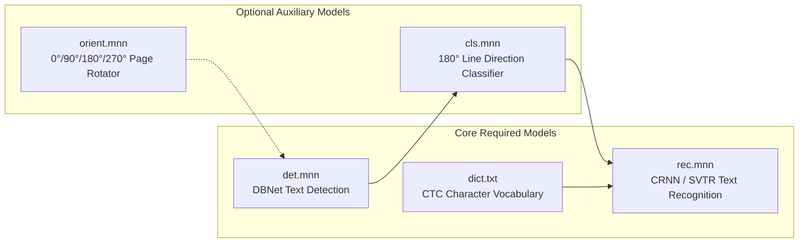

RustO! supports all major PaddleOCR model generations converted to Alibaba's lightweight [MNN](https://github.com/alibaba/MNN) format.

## Model Tiers Comparison

| Model Series | Tier / Variant     | Total Size  | Backbone Architecture  | Target Environment                |
| ------------ | ------------------ | ----------- | ---------------------- | --------------------------------- |
| **PP-OCRv6** | **Tiny** (Default) | **~6.0 MB** | PPLCNetV4 + MetaFormer | Mobile, Edge, IoT, Serverless     |
| **PP-OCRv6** | **Small**          | ~30 MB      | PPLCNetV4 Enhanced     | Desktop, Edge Server              |
| **PP-OCRv6** | **Medium**         | ~134 MB     | ResNet + Transformer   | High-Precision Cloud Server       |
| **PP-OCRv5** | **Mobile**         | ~28 MB      | PPLCNetV3 + SVTR-LCNet | Mobile & Embedded Systems         |
| **PP-OCRv5** | **Server**         | ~270 MB     | ResNet50 + SVTR Large  | High-Capacity Document Processing |
| **PP-OCRv4** | **Mobile**         | ~23 MB      | PPLCNetV2 + SVTR_LCNet | Lightweight Edge Devices          |
| **PP-OCRv4** | **Server**         | ~300 MB     | ResNet50 + SVTR        | Server OCR Clusters               |

---

## Model File Composition

Each complete OCR session consists of the following components:



---

## Model Conversion & Quantization

MNN models utilized by RustO! are converted from native PaddlePaddle / ONNX checkpoints and optimized:

- **FP16 Half-Precision**: Default for Mobile and Tiny tiers, halving memory bandwidth while preserving 99.8%+ FP32 parity.
- **Operator Fusion**: Fused Convolution + BatchNorm + HardSwish activations for sub-millisecond layer execution.
- **Dynamic Input Resizing**: Detectors accept variable dimension sizes without fixed padding waste.

---

## Downloading Models via Script

Use the built-in downloader script to fetch models from the [ModelScope RapidOCR](https://www.modelscope.cn/models/RapidAI/RapidOCR) repository:

```bash
# 1. Download recommended default PP-OCRv6 Tiny models
bash scripts/download_models.sh --model ppocrv6 --tier tiny --output-dir models/PPOCR_v6_tiny

# 2. Download PP-OCRv5 Mobile models with Latin language pack
bash scripts/download_models.sh --model ppocrv5 --tier mobile --lang latin --output-dir models/PPOCR_v5_latin

# 3. Download PP-OCRv4 Mobile models with Japanese dictionary
bash scripts/download_models.sh --model ppocrv4 --tier mobile --lang japan --output-dir models/PPOCR_v4_japan

# 4. Download all available model tiers and languages
bash scripts/download_models.sh --all --output-dir models/all_models
```
