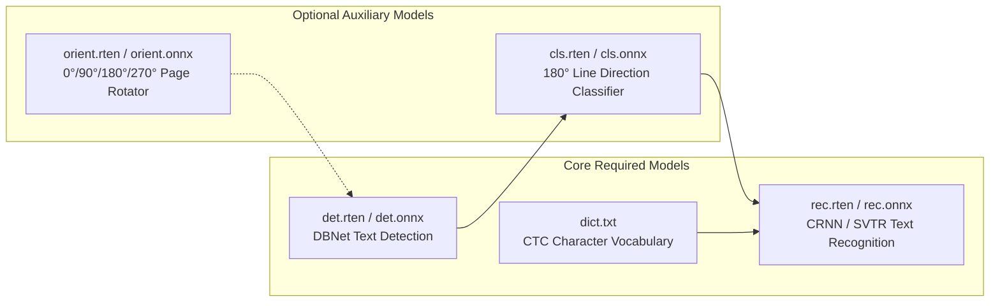

RustO! natively runs PaddleOCR models via the pure-Rust [RTen](https://github.com/robertknight/rten) engine (`.rten` and `.onnx` formats) with zero C++ or external runtime dependencies. In addition, its composable **`InferenceSession`** trait allows you to plug in any custom inference backend (such as ONNX Runtime `ort`, Tract, Candle, Burn, WebGPU, or hardware accelerators) with zero changes to downstream OCR post-processing.

## Model Tiers Comparison

| Model Series | Tier / Variant     | Total Size  | Backbone Architecture  | Target Environment                |
| ------------ | ------------------ | ----------- | ---------------------- | --------------------------------- |
| **PP-OCRv6** | **Tiny** (Default) | **~6.0 MB** | PPLCNetV4 + MetaFormer | Mobile, Edge, IoT, Serverless     |
| **PP-OCRv6** | **Small**          | ~30 MB      | PPLCNetV4 Enhanced     | Desktop, Edge Server              |
| **PP-OCRv6** | **Medium**         | ~134 MB     | ResNet + Transformer   | High-Precision Cloud Server       |
| **PP-OCRv5** | **Mobile**         | ~28 MB      | PPLCNetV3 + SVTR-LCNet | Mobile & Embedded Systems         |
| **PP-OCRv5** | **Server**         | ~270 MB     | ResNet50 + SVTR Large  | High-Capacity Document Processing |
| **PP-OCRv4** | **Mobile**         | ~23 MB      | PPLCNetV2 + SVTR_LCNet | Lightweight Edge Devices          |
| **PP-OCRv4** | **Server**         | ~300 MB     | ResNet50 + SVTR        | Server OCR Clusters               |

---

## Model File Composition

Each complete OCR session consists of the following components:


```mermaid
flowchart LR
    subgraph CoreModels ["Core Required Models"]
        DET["det.rten / det.onnx<br/>DBNet Text Detection"]
        REC["rec.rten / rec.onnx<br/>CRNN / SVTR Text Recognition"]
        DICT["dict.txt<br/>CTC Character Vocabulary"]
    end

    subgraph AuxiliaryModels ["Optional Auxiliary Models"]
        CLS["cls.rten / cls.onnx<br/>180&deg; Line Direction Classifier"]
        ORIENT["orient.rten / orient.onnx<br/>0&deg;/90&deg;/180&deg;/270&deg; Page Rotator"]
    end

    ORIENT -.-> DET
    DET --> CLS
    CLS --> REC
    DICT --> REC
```

---

## Pluggable Engine Composition

RustO! provides the generic `InferenceSession` trait and `EngineSession` wrapper, decoupling OCR preprocessing and geometry from the inference backend. You can substitute RTen with any custom inference engine:

```rust
use rusto::{InferenceSession, EngineError, RustO, InitializeConfig};
use ndarray::ArrayD;
use std::collections::HashMap;

// 1. Implement InferenceSession for your custom engine (e.g. Tract, ORT, Candle)
struct MyCustomEngine { /* ... */ }

impl InferenceSession for MyCustomEngine {
    fn run(&mut self, input: ArrayD<f32>) -> Result<ArrayD<f32>, EngineError> {
        // Run inference on single input tensor...
        todo!()
    }
    fn run_all(&mut self, input: ArrayD<f32>) -> Result<HashMap<String, ArrayD<f32>>, EngineError> {
        todo!()
    }
    fn run_with_inputs(&mut self, inputs: HashMap<String, ArrayD<f32>>) -> Result<HashMap<String, ArrayD<f32>>, EngineError> {
        todo!()
    }
}

// 2. Initialize RustO! with your custom engines
let config = InitializeConfig::ppv6("models/det.rten", "models/rec.rten", "models/dict.txt");
let ocr = RustO::with_custom_engines(config, MyCustomEngine { /* ... */ }, MyCustomEngine { /* ... */ })?;
```

---

## Model Conversion & Optimization

Models utilized by RustO! are converted from native PaddlePaddle / ONNX checkpoints into `.rten` or `.onnx`:

- **Native `.rten` Format**: Compact flatbuffer-like binary model format designed for fast zero-copy memory mapping.
- **Pure-Rust Inference**: Zero C++ compiler, zero `cmake`, and zero native shared library dependencies needed at build or runtime.
- **Operator Fusion & SIMD**: Accelerated via AVX2/AVX-512 on x86-64 and NEON on ARM64 platforms.
- **Dynamic Input Resizing**: Detectors accept variable dimension sizes without fixed padding waste.

---

## Downloading Models via Script

Use the built-in downloader script to fetch models from the [ModelScope RapidOCR](https://www.modelscope.cn/models/RapidAI/RapidOCR) repository:

```bash
# 1. Download recommended default PP-OCRv6 Tiny models
bash scripts/download_models.sh --model ppocrv6 --tier tiny --output-dir models/PPOCR_v6_tiny

# 2. Download PP-OCRv5 Mobile models with Latin language pack
bash scripts/download_models.sh --model ppocrv5 --tier mobile --lang latin --output-dir models/PPOCR_v5_latin

# 3. Download PP-OCRv4 Mobile models with Japanese dictionary
bash scripts/download_models.sh --model ppocrv4 --tier mobile --lang japan --output-dir models/PPOCR_v4_japan

# 4. Download all available model tiers and languages
bash scripts/download_models.sh --all --output-dir models/all_models
```
