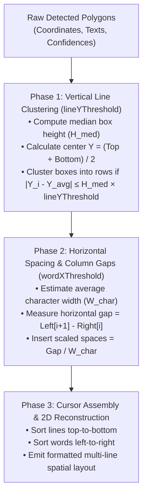

Standard OCR engines return a flat list of disconnected bounding boxes, losing table structures, column gaps, and line indentations.

RustO! includes a built-in **Spatial Layout Reconstruction Engine** that analyzes 2D geometric relationships to produce formatted, visually aligned text.

## 🎯 How the Algorithm Works



---

## Visual Comparison: Output Modes

Consider a standard retail invoice with two item rows and two columns:

### 1. Flat Line List (`output: "lines"`)

```text
Item Description
Amount
Coffee Latte
$4.50
Croissant
$3.50
Total
$8.00
```

_(Notice how column relationships are flattened into a single vertical sequence)._

### 2. Reconstructed Spatial Text (`output: "spatial"`)

```text
Item Description                       Amount
Coffee Latte                            $4.50
Croissant                               $3.50
─────────────────────────────────────────────
Total                                   $8.00
```

_(Column headers, tabular items, and total rows remain aligned in their original 2D positions)._

---

## ⚙️ Tuning Spatial Parameters

Spatial reconstruction is controlled at runtime via `OcrRunOptions`:

```rust
let options = OcrRunOptions {
    output: OutputGranularity::Spatial,
    line_y_threshold: Some(0.5), // Vertical row clustering tolerance
    word_x_threshold: Some(0.4), // Horizontal word & column spacing tolerance
    ..Default::default()
};
```

### Parameter Guidelines

| Parameter            | Default | When to Increase                                                                                                 | When to Decrease                                                                                              |
| -------------------- | ------- | ---------------------------------------------------------------------------------------------------------------- | ------------------------------------------------------------------------------------------------------------- |
| **`lineYThreshold`** | `0.5`   | Increase (`0.7` - `0.9`) if slightly wavy, handheld, or skewed receipt lines get fragmented into multiple lines. | Decrease (`0.2` - `0.35`) for dense spreadsheets or multi-line tables where rows are packed tightly together. |
| **`wordXThreshold`** | `0.4`   | Increase (`0.6` - `0.8`) to merge spaced words across wider gaps into single phrases.                            | Decrease (`0.2` - `0.3`) to preserve distinct column boundaries in tightly aligned data tables.               |

---

## 💡 Practical Examples by Platform

### Rust

```rust
let spatial_text = match ocr.detect_text(&image_source, &OcrRunOptions {
    output: OutputGranularity::Spatial,
    line_y_threshold: Some(0.5),
    word_x_threshold: Some(0.4),
    ..Default::default()
})? {
    DetectTextResult::Spatial(text) => text,
    _ => unreachable!(),
};
println!("{spatial_text}");
```

### React Native

```typescript
const formattedLayout = await detectText(
  { uri: 'file:///path/to/invoice.jpg' },
  {
    output: 'spatial',
    lineYThreshold: 0.5,
    wordXThreshold: 0.4,
  }
);
console.log(formattedLayout);
```
