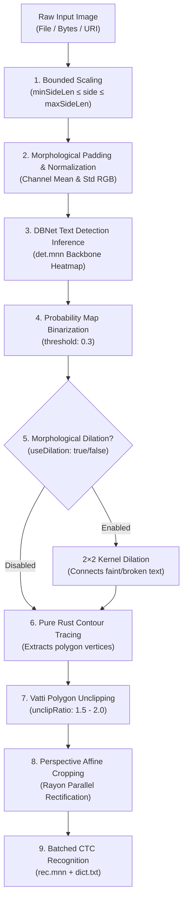

RustO! gives you fine-grained, request-local control over image resizing, DBNet detector thresholds, morphological operators, and polygon clipping.

## 🛠️ Complete Preprocessing Flowchart



---

## 🎛️ Parameters Reference

All parameters can be configured per call in `OcrRunOptions` (`DetectTextOptions` in React Native):

```typescript
const options = {
  // 1. Overall Image Scaling Bounds
  minSideLen: 64, // Minimum side bound (pixels)
  maxSideLen: 1600, // Maximum side bound (pixels) - prevents OOM on 48MP photos
  minHeight: 32, // Minimum padded height
  widthHeightRatio: -1, // -1 preserves original aspect ratio

  // 2. DBNet Detector Input Tuning
  detection: {
    limitSideLen: 960, // Target resize dimension for detector
    limitType: 'max', // 'min' (boost small text) or 'max' (bound large photos)
    mean: [0.485, 0.456, 0.406],
    std: [0.229, 0.224, 0.225],
  },

  // 3. Polygon & Binarization Postprocessing
  postprocess: {
    threshold: 0.3, // Pixel binarization probability cutoff (0.0 to 1.0)
    boxThreshold: 0.6, // Text polygon confidence threshold (0.0 to 1.0)
    maxCandidates: 1000, // Maximum candidate polygons retained
    unclipRatio: 2.0, // Polygon boundary expansion factor
    useDilation: true, // 2x2 morphological dilation for faint/broken text
  },
};
```

---

## 💡 Practical Optimization Cheat-Sheet

### 1. Faint Thermal Receipts & Dot-Matrix Prints

Thermal paper and dot-matrix receipts often feature broken character strokes:

```typescript
const faintReceiptOptions = {
  textScore: 0.45,
  postprocess: {
    useDilation: true, // Connects broken character strokes
    threshold: 0.25, // Lowers binarization threshold for light grey print
    unclipRatio: 2.2, // Generously expands text regions
  },
};
```

### 2. High-Resolution Mobile Camera Photos (48MP - 108MP)

Massive raw mobile camera photos consume gigabytes of memory if not bounded before neural inference:

```typescript
const mobileCameraOptions = {
  maxSideLen: 1600, // Downscales before memory allocation
  detection: {
    limitSideLen: 960,
    limitType: 'max',
  },
};
```

### 3. Small, Dense Document Scans (Legal Contracts / Multi-Column Tables)

Ensures fine 6pt/8pt fonts remain crisp during detection:

```typescript
const denseScanOptions = {
  detection: {
    limitSideLen: 1200,
    limitType: 'min', // Raises shorter side to ensure small characters are readable
  },
  postprocess: {
    useDilation: false, // Prevents adjacent compact characters from merging
    unclipRatio: 1.6,
  },
};
```
