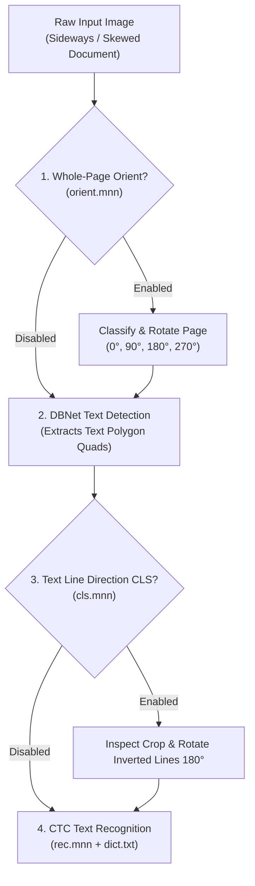

Mobile camera captures and document scans often feature skewed angles, upside-down documents, or mixed text directions.

RustO! provides two distinct orientation correction stages:



---

## 1. Text Line Direction Classifier (CLS)

The CLS model inspects cropped text regions produced by the DBNet detector. If a text line is inverted (180° upside-down), it rotates the crop upright before passing it to the CTC text recognizer.

> [!NOTE]
> Text line direction classification (`cls.mnn`) is supported on **PP-OCRv4** and **PP-OCRv5** models. PP-OCRv6 models use an orientation-robust recognition network.

### Initialization Configuration

```rust
use rusto::InitializeConfig;

// Initialize engine and attach CLS model with 0.9 confidence threshold
let config = InitializeConfig::ppv5("models/det.mnn", "models/rec.mnn", "models/dict.txt")
    .with_cls_threshold("models/cls.mnn", 0.9);

let mut ocr = RustO::initialize(config)?;
```

### Request-Local Activation

Enable CLS classification for specific scans via `OcrRunOptions`:

```rust
let options = OcrRunOptions {
    classification: Some(true), // Activates CLS evaluation for this request
    ..Default::default()
};
```

---

## 2. Whole-Page Document Orientation Classifier

For documents photographed sideways (90° / 270°) or completely upside down (180°):

```rust
let config = InitializeConfig::ppv5("models/det.mnn", "models/rec.mnn", "models/dict.txt")
    .with_orientation_threshold("models/orient.mnn", 0.85);

let mut ocr = RustO::initialize(config)?;
```

### Request-Local Activation

```rust
let options = OcrRunOptions {
    orientation: Some(true), // Classifies and rotates the whole page before detection
    ..Default::default()
};
```

---

## 📱 Cross-Binding Example (React Native)

```typescript
import { detectText, initialize } from 'react-native-rusto';

// Initialize with model references
await initialize({
  preset: 'ppv5',
  models: {
    detection: 'det.mnn',
    recognition: 'rec.mnn',
    dictionary: 'dict.txt',
    classification: 'cls.mnn',
    orientation: 'orient.mnn',
  },
});

// Enable orientation correction on demand
const results = await detectText(
  { uri: 'file:///path/to/sideways_document.jpg' },
  {
    orientation: true, // Fixes 90°/270° whole-page rotation
    classification: true, // Fixes 180° upside-down text lines
  }
);
```
