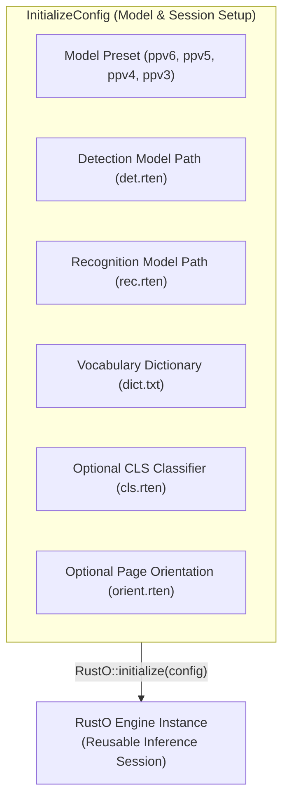

`InitializeConfig` configures model files, vocabulary dictionaries, and auxiliary networks to instantiate a reusable OCR engine session.

## Architecture Contract



---

## Canonical Wire Schema

For C FFI, JNI, and standalone binding JSON serialization:

```json
{
  "template": "ppv6",
  "detection": {
    "modelPath": "models/det.rten",
    "thresh": 0.3,
    "boxThresh": 0.6,
    "unclipRatio": 2.0,
    "limitSideLen": 736,
    "limitType": "min",
    "useDilation": true
  },
  "recognition": {
    "modelPath": "models/rec.rten",
    "dictPath": "models/dict.txt"
  },
  "classification": {
    "enabled": true,
    "modelPath": "models/cls.rten",
    "thresh": 0.9
  },
  "orientation": {
    "enabled": true,
    "modelPath": "models/orient.rten",
    "thresh": 0.85
  }
}
```

---

## Presets Reference

| Preset           | Default Detector Resize | Default Resize Mode | Default Unclip Ratio | Compatible Architecture        |
| ---------------- | ----------------------- | ------------------- | -------------------- | ------------------------------ |
| `ppv6` (Default) | `736`                   | `min`               | `2.0`                | PP-OCRv6 (Tiny, Small, Medium) |
| `ppv5`           | `736`                   | `min`               | `2.0`                | PP-OCRv5 (Mobile, Server)      |
| `ppv4`           | `960`                   | `max`               | `1.5`                | PP-OCRv4 (Mobile, Server)      |
| `ppv3`           | `960`                   | `max`               | `1.5`                | PP-OCRv3                       |

---

## Public API Across All Bindings

### Rust

```rust
use rusto::{InitializeConfig, RustO};

// Method 1: Constructor with default PP-OCRv6 preset
let config = InitializeConfig::ppv6("det.rten", "rec.rten", "dict.txt")
    .with_det_thresh(0.3)
    .with_det_box_thresh(0.6)
    .with_unclip_ratio(2.0)
    .with_use_dilation(true)
    .with_cls_threshold("cls.rten", 0.9)
    .with_orientation_threshold("orient.rten", 0.85);

let mut ocr = RustO::initialize(config)?;

// Method 2: Custom inference engines via InferenceSession trait
// let ocr = RustO::with_custom_engines(config, custom_det_session, custom_rec_session)?;
```

### .NET / C#

```csharp
using RustODotnet;

var config = new InitializeConfig
{
    Template = "ppv6",
    Detection = new DetectionConfig { ModelPath = "det.rten" },
    Recognition = new RecognitionConfig { ModelPath = "rec.rten", DictPath = "dict.txt" },
    Classification = new ClassificationConfig { Enabled = true, ModelPath = "cls.rten", Thresh = 0.9f },
    Orientation = new OrientationConfig { Enabled = true, ModelPath = "orient.rten", Thresh = 0.85f }
};

using var ocr = RustO.Initialize(config);
```

### iOS (Swift)

```swift
import RustO

let config = InitializeConfig(
    template: "ppv6",
    detection: DetectionConfig(modelPath: "det.rten"),
    recognition: RecognitionConfig(modelPath: "rec.rten", dictPath: "dict.txt"),
    classification: ClassificationConfig(enabled: true, modelPath: "cls.rten", thresh: 0.9),
    orientation: OrientationConfig(enabled: true, modelPath: "orient.rten", thresh: 0.85)
)

let ocr = try RustO.initialize(config: config)
```

### Android (Kotlin)

```kotlin
import com.byrizki.rusto.*

val config = InitializeConfig(
    template = "ppv6",
    detection = DetectionConfig(modelPath = "det.rten"),
    recognition = RecognitionConfig(modelPath = "rec.rten", dictPath = "dict.txt"),
    classification = ClassificationConfig(enabled = true, modelPath = "cls.rten", thresh = 0.9f),
    orientation = OrientationConfig(enabled = true, modelPath = "orient.rten", thresh = 0.85f)
)

val ocr = RustO.initialize(context, config)
```

### React Native

```typescript
import { initialize } from '@rusto/react-native';

await initialize({
  preset: 'ppv6',
  models: {
    detection: 'det.rten',
    recognition: 'rec.rten',
    dictionary: 'dict.txt',
    classification: 'cls.rten',
    orientation: 'orient.rten',
  },
});
```

### C FFI

```c
#include "librusto.h"

const char *config_json = "{\"template\":\"ppv6\",\"detection\":{\"modelPath\":\"det.rten\"},\"recognition\":{\"modelPath\":\"rec.rten\",\"dictPath\":\"dict.txt\"}}";
ROCRHandle *handle = rocr_initialize(config_json);

// Later:
rocr_free(handle);
```
