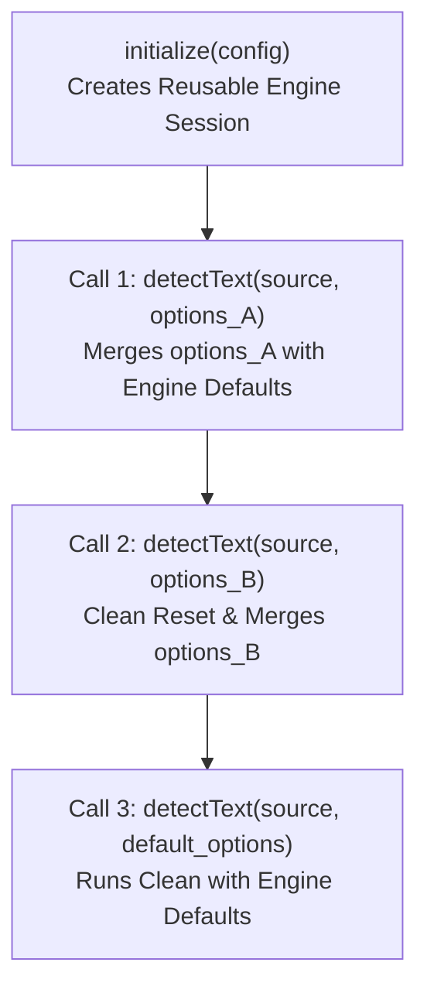

`OcrRunOptions` (`DetectTextOptions` in React Native) configures runtime parameters for an individual OCR execution. It applies to a single `detectText` call without mutating or re-allocating the underlying engine session.



---

## Canonical Wire Schema

```json
{
  "output": "lines",
  "lineYThreshold": 0.5,
  "wordXThreshold": 0.4,
  "textScore": 0.5,
  "classification": false,
  "orientation": false,
  "minHeight": 32,
  "maxSideLen": 1600,
  "minSideLen": 64,
  "widthHeightRatio": -1,
  "detection": {
    "limitSideLen": 960,
    "limitType": "max",
    "mean": [0.485, 0.456, 0.406],
    "std": [0.229, 0.224, 0.225]
  },
  "postprocess": {
    "threshold": 0.3,
    "boxThreshold": 0.6,
    "maxCandidates": 1000,
    "unclipRatio": 2.0,
    "useDilation": true
  }
}
```

---

## Parameters Specification

### 1. Output & Grouping Controls

| Option           | Type              | Default               | Allowed Range               | Description                                                                   |
| ---------------- | ----------------- | --------------------- | --------------------------- | ----------------------------------------------------------------------------- |
| `output`         | `string` / `enum` | `lines`               | `lines`, `words`, `spatial` | Selects structured lines, structured words, or formatted spatial text.        |
| `lineYThreshold` | `float`           | `0.5`                 | `>= 0.0`                    | Vertical tolerance multiplier for clustering bounding boxes into lines.       |
| `wordXThreshold` | `float`           | `0.4`                 | `>= 0.0`                    | Horizontal character-width multiplier for column separation and word spacing. |
| `textScore`      | `float`           | Engine Preset (`0.5`) | `0.0 .. 1.0`                | Minimum recognition confidence cutoff score.                                  |
| `classification` | `boolean`         | `false`               | `true`, `false`             | Evaluates 180° text line orientation classifier (requires CLS model).         |
| `orientation`    | `boolean`         | `false`               | `true`, `false`             | Evaluates whole-page orientation classifier (requires Orient model).          |

---

### 2. Image Scaling & Bounds

| Option             | Type    | Default  | Allowed Range              | Description                                                                 |
| ------------------ | ------- | -------- | -------------------------- | --------------------------------------------------------------------------- |
| `minSideLen`       | `float` | `64.0`   | `> 0.0`                    | Minimum allowed side length for bounded scaling.                            |
| `maxSideLen`       | `float` | `1600.0` | `minSideLen <= maxSideLen` | Maximum image side length (prevents out-of-memory on 48MP photos).          |
| `minHeight`        | `float` | `32.0`   | `> 0.0`                    | Minimum vertical height for morphological padding.                          |
| `widthHeightRatio` | `float` | `-1.0`   | `> 0.0` or `-1.0`          | Recognition padding aspect ratio. `-1` preserves native image aspect ratio. |

---

### 3. Detector Input Tuning (`detection`)

| Option         | Type       | Default                 | Allowed Range      | Description                                                              |
| -------------- | ---------- | ----------------------- | ------------------ | ------------------------------------------------------------------------ |
| `limitSideLen` | `integer`  | Preset (`736` / `960`)  | `1 .. 32767`       | Target image resize bound for DBNet detector input.                      |
| `limitType`    | `string`   | Preset (`min` / `max`)  | `min`, `max`       | `min`: scales shorter side to target. `max`: caps longer side at target. |
| `mean`         | `float[3]` | `[0.485, 0.456, 0.406]` | 3 finite numbers   | Channel-wise RGB normalization mean.                                     |
| `std`          | `float[3]` | `[0.229, 0.224, 0.225]` | 3 non-zero numbers | Channel-wise RGB normalization standard deviation.                       |

---

### 4. Detector Postprocessing (`postprocess`)

| Option          | Type      | Default                   | Allowed Range   | Description                                                                |
| --------------- | --------- | ------------------------- | --------------- | -------------------------------------------------------------------------- |
| `threshold`     | `float`   | Preset (`0.3`)            | `0.0 .. 1.0`    | Pixel binarization probability map cutoff threshold.                       |
| `boxThreshold`  | `float`   | Preset (`0.6` / `0.5`)    | `0.0 .. 1.0`    | Text candidate polygon average confidence score threshold.                 |
| `maxCandidates` | `integer` | `1000`                    | `>= 1`          | Maximum candidate polygon contours retained for processing.                |
| `unclipRatio`   | `float`   | Preset (`2.0` / `1.5`)    | `> 0.0`         | Vatti polygon expansion ratio to capture full stroke ascenders/descenders. |
| `useDilation`   | `boolean` | Preset (`true` / `false`) | `true`, `false` | Applies 2×2 morphological dilation for faint or broken strokes.            |

---

## Complete Multi-Language Examples

### Rust

```rust
use rusto::{DetectionRunOptions, OcrRunOptions, OutputGranularity, PostprocessRunOptions};

let options = OcrRunOptions {
    output: OutputGranularity::Words,
    text_score: Some(0.55),
    line_y_threshold: Some(0.5),
    word_x_threshold: Some(0.4),
    max_side_len: Some(1600.0),
    detection: Some(DetectionRunOptions {
        limit_side_len: Some(960),
        limit_type: Some("max".into()),
        ..Default::default()
    }),
    postprocess: Some(PostprocessRunOptions {
        use_dilation: Some(true),
        unclip_ratio: Some(2.0),
        ..Default::default()
    }),
    ..Default::default()
};
```

### .NET / C#

```csharp
using RustODotnet;

var options = new OcrRunOptions
{
    Output = OutputGranularity.Words,
    TextScore = 0.55f,
    LineYThreshold = 0.5f,
    WordXThreshold = 0.4f,
    MaxSideLen = 1600f,
    Detection = new DetectionRunOptions
    {
        LimitSideLen = 960,
        LimitType = "max"
    },
    Postprocess = new PostprocessRunOptions
    {
        UseDilation = true,
        UnclipRatio = 2.0f
    }
};
```

### Swift (iOS)

```swift
import RustO

let options = OcrRunOptions(
    output: .words,
    lineYThreshold: 0.5,
    wordXThreshold: 0.4,
    textScore: 0.55,
    maxSideLen: 1600,
    detection: DetectionRunOptions(limitSideLen: 960, limitType: "max"),
    postprocess: PostprocessRunOptions(useDilation: true, unclipRatio: 2.0)
)
```

### Kotlin (Android)

```kotlin
import com.byrizki.rusto.*

val options = OcrRunOptions(
    output = OutputGranularity.WORDS,
    lineYThreshold = 0.5f,
    wordXThreshold = 0.4f,
    textScore = 0.55f,
    maxSideLen = 1600f,
    detection = DetectionRunOptions(limitSideLen = 960, limitType = "max"),
    postprocess = PostprocessRunOptions(useDilation = true, unclipRatio = 2.0f)
)
```

### React Native

```typescript
import { DetectTextOptions } from 'react-native-rusto';

const options: DetectTextOptions = {
  output: 'words',
  lineYThreshold: 0.5,
  wordXThreshold: 0.4,
  textScore: 0.55,
  maxSideLen: 1600,
  detection: {
    limitSideLen: 960,
    limitType: 'max',
  },
  postprocess: {
    useDilation: true,
    unclipRatio: 2.0,
  },
};
```
