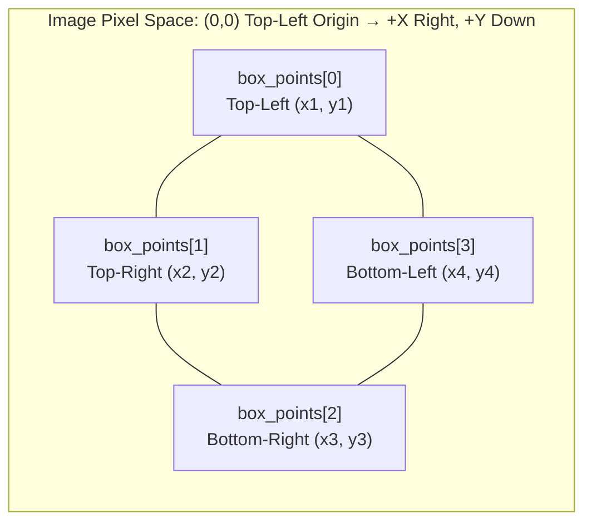

Every OCR detection execution processes one `ImageSource` and returns either structured bounding blocks or reconstructed spatial text.

## 📥 Input Image Sources

| Binding          | File / URI Source            | In-Memory Buffer Source                         | Notes                                                    |
| ---------------- | ---------------------------- | ----------------------------------------------- | -------------------------------------------------------- |
| **Rust**         | `ImageSource::Path(PathBuf)` | `ImageSource::Bytes(Vec<u8>)`                   | In-memory decoding uses pure Rust `image` engine.        |
| **.NET**         | `UriImageSource(string)`     | `BytesImageSource(byte[])`                      | Accepts filesystem paths or `file:` URIs.                |
| **Swift**        | `.uri(String)`               | `.bytes(Data)`                                  | Accepts filesystem paths or file URL strings.            |
| **Kotlin**       | `ImageSource.Uri(String)`    | `ImageSource.Bytes(ByteArray)`                  | Natively resolves `content://` URIs and `file://` paths. |
| **React Native** | `{ uri: string }`            | `{ base64: string }` or `{ bytes: Uint8Array }` | Exactly one key required in object payload.              |

---

## 📐 Coordinate Space & Geometry

Coordinates are expressed in image pixel units relative to the top-left origin `(0, 0)`:



- **`box_points`**: Exactly 4 quadrilateral polygon vertices: `[Top-Left, Top-Right, Bottom-Right, Bottom-Left]`. Follows true text rotation angle.
- **`frame`**: Axis-aligned bounding rectangle: `(left, top, width, height)` computed from the polygon bounds.

---

## 📤 Output Modes Breakdown

| Mode                  | Return Shape                     | Use Case                                                                              |
| --------------------- | -------------------------------- | ------------------------------------------------------------------------------------- |
| **`lines`** (Default) | Structured List (`TextResult[]`) | Standard document reading, paragraph parsing, and form field extraction line by line. |
| **`words`**           | Structured List (`TextResult[]`) | Interactive word tapping, word-level highlighting, or granular bounding box overlays. |
| **`spatial`**         | Plaintext String (`string`)      | Preserves 2D columns, tabular alignment, receipt rows, and document indentations.     |

---

## 🗂️ Structured Data Model (`TextResult`)

```json
[
  {
    "text": "Total Due",
    "score": 0.992,
    "box_points": [
      [40.0, 120.0],
      [140.0, 120.0],
      [140.0, 148.0],
      [40.0, 148.0]
    ],
    "frame": {
      "left": 40.0,
      "top": 120.0,
      "width": 100.0,
      "height": 28.0
    }
  },
  {
    "text": "$250.00",
    "score": 0.987,
    "box_points": [
      [280.0, 120.0],
      [360.0, 120.0],
      [360.0, 148.0],
      [280.0, 148.0]
    ],
    "frame": {
      "left": 280.0,
      "top": 120.0,
      "width": 80.0,
      "height": 28.0
    }
  }
]
```

### Type Mapping Across Bindings

| Concept          | Rust              | .NET / C#                   | Swift (iOS)      | Kotlin (Android)   | React Native      |
| ---------------- | ----------------- | --------------------------- | ---------------- | ------------------ | ----------------- |
| **Collection**   | `Vec<TextResult>` | `IReadOnlyList<TextResult>` | `[TextResult]`   | `List<TextResult>` | `TextResult[]`    |
| **Text String**  | `item.text`       | `item.Text`                 | `item.text`      | `item.text`        | `item.text`       |
| **Confidence**   | `item.score`      | `item.Score`                | `item.score`     | `item.score`       | `item.score`      |
| **Polygon Quad** | `item.box_points` | `item.BoxPoints`            | `item.boxPoints` | `item.boxPoints`   | `item.box_points` |
| **Frame**        | `item.frame`      | `item.Frame`                | `item.frame`     | `item.frame`       | `item.frame`      |

---

## 💻 Result Handling Examples

### Rust

```rust
match ocr.detect_text(&source, &options)? {
    DetectTextResult::Structured(items) => {
        for item in items {
            println!("{} ({:.1}%) at [{}, {}]", item.text, item.score * 100.0, item.frame.left, item.frame.top);
        }
    }
    DetectTextResult::Spatial(spatial_text) => {
        println!("{spatial_text}");
    }
}
```

### .NET / C#

```csharp
var result = ocr.DetectText(source, options);

if (result is StructuredDetectTextResult structured)
{
    foreach (var item in structured.Items)
    {
        Console.WriteLine($"{item.Text} ({item.Score:P0}) [{item.Frame.Left}, {item.Frame.Top}]");
    }
}
else if (result is SpatialDetectTextResult spatial)
{
    Console.WriteLine(spatial.Text);
}
```

### iOS (Swift)

```swift
let result = try ocr.detectText(source, options: options)

switch result {
case .structured(let items):
    for item in items {
        print("\(item.text) (\(item.score)) [\(item.frame.left), \(item.frame.top)]")
    }
case .spatial(let text):
    print(text)
}
```

### Android (Kotlin)

```kotlin
when (val result = ocr.detectText(source, options)) {
    is DetectTextResult.Structured -> {
        result.items.forEach { item ->
            println("${item.text} (${item.score}) [${item.frame.left}, ${item.frame.top}]")
        }
    }
    is DetectTextResult.Spatial -> {
        println(result.text)
    }
}
```

### React Native

```typescript
// Lines output -> TextResult[]
const lines = await detectText({ uri }, { output: 'lines' });
lines.forEach((item) => console.log(item.text, item.frame));

// Spatial output -> string
const spatialText = await detectText({ uri }, { output: 'spatial' });
console.log(spatialText);
```
