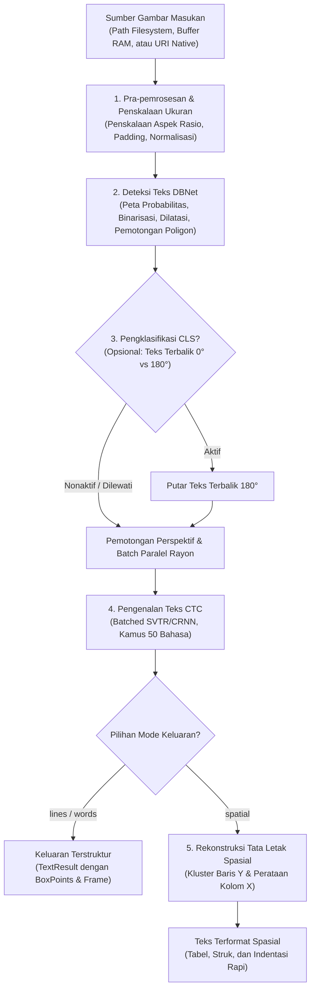

::project-badges
::

**RustO!** adalah mesin _Optical Character Recognition_ (OCR) berperforma tinggi dan toolkit lintas-platform yang ditulis dalam bahasa Rust murni. Berbasis [RapidOCR](https://github.com/RapidAI/RapidOCR) dan ditenagai oleh model _deep learning_ [PaddleOCR](https://github.com/PaddlePaddle/PaddleOCR) dengan mesin inferensi ringan Alibaba [MNN](https://github.com/alibaba/MNN), RustO! menghadirkan kecepatan inferensi sub-detik, konsumsi memori sangat rendah, bebas dari ketergantungan runtime OpenCV, dan mencapai **paritas akurasi 99.3%+** dibandingkan implementasi C++ OpenCV bawaan.

## 🎯 Alur Arsitektur Pipeline

RustO! mengorkestrasi pipeline OCR dan analisis tata letak visual dari ujung ke ujung (_end-to-end_) yang dioptimalkan untuk perangkat _edge_ dan server berkecepatan tinggi:

---

## ⚡ Keunggulan Utama

- **🚀 Inti Rust 100% Murni**: Tanpa dependensi OpenCV. Binarisasi gambar, pelacakan kontur, _polygon clipping_, dan transformasi afinitas diimplementasikan dalam Rust yang aman memori dengan akselerasi SIMD.
- **📦 Ukuran Biner Sangat Ringkas**: Biner mandiri berukuran ~5 MB, dibandingkan 50+ MB pada tumpukan OpenCV + ONNX runtime tradisional.
- **📄 Rekonstruksi Tata Letak Spasial**: Dukungan bawaan untuk merekonstruksi struk, faktur (invoice), tabel multikolom, dan formulir langsung menjadi teks yang terformat rapi.
- **🧠 Ekosistem Model Lengkap**: Dukungan langsung untuk arsitektur **PP-OCRv6** (Tiny, Small, Medium), **PP-OCRv5** (Mobile, Server), dan **PP-OCRv4** (Mobile, Server).
- **🌐 50+ Bahasa dalam Satu Model**: PP-OCRv6 menggunakan kamus terpadu yang mendukung alfabet Latin, Sirilik, CJK (Mandarin/Jepang/Korea), Dewanagari, Arab, dan lainnya secara bersamaan.
- **📱 SDK Lintas Platform**: Paket siap pakai untuk **Rust**, **.NET / C#**, **React Native**, **iOS (Swift)**, **Android (Kotlin)**, dan **C FFI**.

---

## 📦 Ekosistem Paket & Platform yang Didukung

| Platform         | Paket Target / Registry                                                                       | Matriks Dukungan                                         |
| ---------------- | --------------------------------------------------------------------------------------------- | -------------------------------------------------------- |
| **Rust**         | `cargo add rusto-rs` ([crates.io](https://crates.io/crates/rusto-rs))                         | Linux, macOS, Windows, Android (NDK), iOS                |
| **.NET / C#**    | `dotnet add package RustODotnet` ([NuGet](https://www.nuget.org/packages/RustODotnet))        | .NET 6.0+, .NET 8.0+, .NET Standard 2.0+ (Win/Mac/Linux) |
| **React Native** | `npm install react-native-rusto` ([npm](https://www.npmjs.com/package/react-native-rusto))    | React Native 0.70+ (Arsitektur Baru & Lama), Expo        |
| **iOS**          | `pod 'RustO'` ([CocoaPods](https://cocoapods.org/pods/RustO))                                 | iOS 13.0+, Mac Catalyst (arm64, x86_64)                  |
| **Android**      | `com.github.byrizki.rusto-rs:rusto-android` ([JitPack](https://jitpack.io/#byrizki/rusto-rs)) | Android API 21+ (ARM64-v8a, ARMv7a, x86_64, x86)         |
| **C / Native**   | `librusto.so` / `librusto.dylib` / `rusto.dll`                                                | C99 / C++11 dan semua bahasa dengan C FFI bindings       |
| **CLI**          | Biner `rusto`                                                                                 | Aplikasi CLI mandiri untuk desktop & automasi CI         |

---

## 📊 Perbandingan Kinerja & Paritas Akurasi

Pengujian dilakukan pada dokumen invoice standar (A4, 150 DPI) pada CPU AMD Ryzen 7 / Apple M-series:

| Metrik                   | RustO! (Rust Murni + MNN)    | Pipeline Tradisional OpenCV + C++ | Keunggulan                 |
| ------------------------ | ---------------------------- | --------------------------------- | -------------------------- |
| **Kecepatan Deteksi**    | **~80 ms**                   | ~85 ms                            | ⚡ **6% lebih cepat**      |
| **Kecepatan Pengenalan** | **~120 ms**                  | ~125 ms                           | ⚡ **4% lebih cepat**      |
| **Paritas Akurasi**      | **99.3%+**                   | Tolok Ukur (100%)                 | 🎯 Kotak batas identik     |
| **Ukuran Biner**         | **~5 MB**                    | ~55 MB+ (libopencv, onnxruntime)  | 📦 **Hemat 90%**           |
| **Puncak Memori (RAM)**  | **~120 MB**                  | ~260 MB+                          | 🔒 **Hemat 54% memori**    |
| **Keamanan**             | _Memory-safe_ (Jaminan Rust) | Manajemen pointer manual          | 🛡️ Nol celah _memory leak_ |

---

## Langkah Selanjutnya

- [Panduan Instalasi](./2.installation.md) — Pasang RustO! pada platform pilihan Anda.
- [Panduan Memulai Cepat](./3.quick-start.md) — Jalankan pemindaian OCR pertama Anda dalam 5 menit.
- [Panduan Penggunaan Bahasa](../02.how-to/00.use-rust.md) — Tutorial mendalam untuk setiap bahasa pemrograman.
- [Referensi API](../04.api-reference/01.initialize-config.md) — Spesifikasi lengkap `InitializeConfig` dan `OcrRunOptions`.
