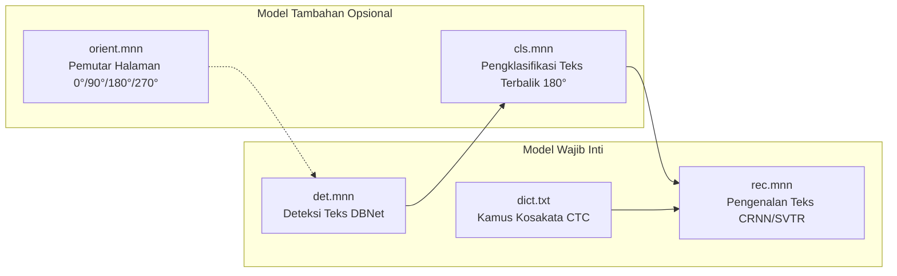

RustO! mendukung seluruh generasi model utama PaddleOCR yang telah dikonversi ke format ringan Alibaba [MNN](https://github.com/alibaba/MNN).

## Perbandingan Tingkatan Model (Model Tiers)

| Seri Model   | Varian / Tier      | Ukuran Total | Arsitektur Backbone    | Target Lingkungan              |
| ------------ | ------------------ | ------------ | ---------------------- | ------------------------------ |
| **PP-OCRv6** | **Tiny** (Default) | **~6.0 MB**  | PPLCNetV4 + MetaFormer | Ponsel, Edge, IoT, Serverless  |
| **PP-OCRv6** | **Small**          | ~30 MB       | PPLCNetV4 Enhanced     | Desktop, Server Edge           |
| **PP-OCRv6** | **Medium**         | ~134 MB      | ResNet + Transformer   | Server Cloud Presisi Tinggi    |
| **PP-OCRv5** | **Mobile**         | ~28 MB       | PPLCNetV3 + SVTR-LCNet | Ponsel & Sistem Tersemat       |
| **PP-OCRv5** | **Server**         | ~270 MB      | ResNet50 + SVTR Large  | Pemrosesan Dokumen Skala Besar |
| **PP-OCRv4** | **Mobile**         | ~23 MB       | PPLCNetV2 + SVTR_LCNet | Perangkat Edge Ringan          |
| **PP-OCRv4** | **Server**         | ~300 MB      | ResNet50 + SVTR        | Kluster Server OCR             |

---

## Struktur File Model

Setiap sesi inferensi OCR lengkap terdiri dari komponen-komponen berikut:



---

## Konversi & Kuantisasi Model

Model MNN yang digunakan oleh RustO! dikonversi dari _checkpoint_ PaddlePaddle / ONNX asli dengan optimasi tingkat lanjut:

- **FP16 Half-Precision**: Standar untuk tingkatan Mobile dan Tiny, memotong kebutuhan _bandwidth_ memori hingga separuh dengan paritas FP32 di atas 99.8%.
- **Operator Fusion**: Penggabungan aktivasi Konvolusi + BatchNorm + HardSwish untuk eksekusi sub-milidetik per lapisan.
- **Dynamic Input Resizing**: Detektor mendukung dimensi gambar variabel tanpa pemborosan komputasi pada bantalan statis (_padding_).

---

## Mengunduh Model via Skrip

Gunakan skrip pengunduh bawaan untuk mengambil model dari repositori [ModelScope RapidOCR](https://www.modelscope.cn/models/RapidAI/RapidOCR):

```bash
# 1. Unduh model bawaan default yang direkomendasikan (PP-OCRv6 Tiny)
bash scripts/download_models.sh --model ppocrv6 --tier tiny --output-dir models/PPOCR_v6_tiny

# 2. Unduh model PP-OCRv5 Mobile dengan paket bahasa Latin
bash scripts/download_models.sh --model ppocrv5 --tier mobile --lang latin --output-dir models/PPOCR_v5_latin

# 3. Unduh model PP-OCRv4 Mobile dengan kamus bahasa Jepang
bash scripts/download_models.sh --model ppocrv4 --tier mobile --lang japan --output-dir models/PPOCR_v4_japan

# 4. Unduh seluruh model dan bahasa yang tersedia
bash scripts/download_models.sh --all --output-dir models/all_models
```
