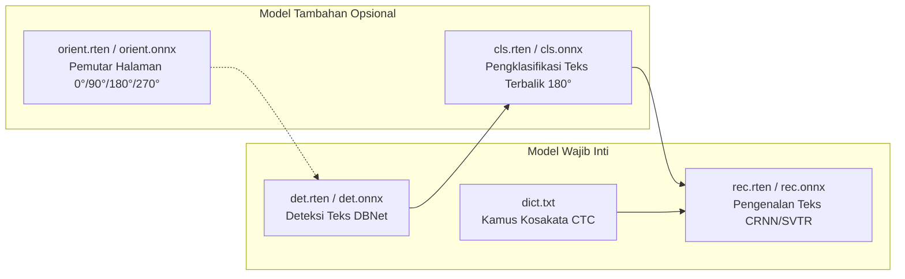

RustO! secara bawaan menjalankan model PaddleOCR menggunakan mesin inferensi Rust murni [RTen](https://github.com/robertknight/rten) (format `.rten` dan `.onnx`) tanpa dependensi runtime C++ eksternal. Selain itu, trait **`InferenceSession`** yang modular memungkinkan penggantian mesin inferensi secara mudah (seperti ONNX Runtime `ort`, Tract, Candle, Burn, WebGPU, atau akselerator NPU) tanpa mengubah logika pasca-pemrosesan OCR.

## Perbandingan Tingkatan Model (Model Tiers)

| Seri Model   | Varian / Tier      | Ukuran Total | Arsitektur Backbone    | Target Lingkungan              |
| ------------ | ------------------ | ------------ | ---------------------- | ------------------------------ |
| **PP-OCRv6** | **Tiny** (Default) | **~6.0 MB**  | PPLCNetV4 + MetaFormer | Ponsel, Edge, IoT, Serverless  |
| **PP-OCRv6** | **Small**          | ~30 MB       | PPLCNetV4 Enhanced     | Desktop, Server Edge           |
| **PP-OCRv6** | **Medium**         | ~134 MB      | ResNet + Transformer   | Server Cloud Presisi Tinggi    |
| **PP-OCRv5** | **Mobile**         | ~28 MB       | PPLCNetV3 + SVTR-LCNet | Ponsel & Sistem Tersemat       |
| **PP-OCRv5** | **Server**         | ~270 MB      | ResNet50 + SVTR Large  | Pemrosesan Dokumen Skala Besar |
| **PP-OCRv4** | **Mobile**         | ~23 MB       | PPLCNetV2 + SVTR_LCNet | Perangkat Edge Ringan          |
| **PP-OCRv4** | **Server**         | ~300 MB      | ResNet50 + SVTR        | Kluster Server OCR             |

---

## Struktur File Model

Setiap sesi inferensi OCR lengkap terdiri dari komponen-komponen berikut:


```mermaid
flowchart LR
    subgraph ModelUtama ["Model Wajib Inti"]
        DET["det.rten / det.onnx<br/>Deteksi Teks DBNet"]
        REC["rec.rten / rec.onnx<br/>Pengenalan Teks CRNN/SVTR"]
        DICT["dict.txt<br/>Kamus Kosakata CTC"]
    end

    subgraph ModelTambahan ["Model Tambahan Opsional"]
        CLS["cls.rten / cls.onnx<br/>Pengklasifikasi Teks Terbalik 180&deg;"]
        ORIENT["orient.rten / orient.onnx<br/>Pemutar Halaman 0&deg;/90&deg;/180&deg;/270&deg;"]
    end

    ORIENT -.-> DET
    DET --> CLS
    CLS --> REC
    DICT --> REC
```

---

## Komposisi Mesin Inferensi Pluggable

RustO! menyediakan trait generik `InferenceSession` dan pembungkus `EngineSession`, memisahkan prapemrosesan dan kalkulasi geometri OCR dari mesin inferensi. Anda dapat mengganti RTen dengan mesin inferensi kustom pilihan Anda:

```rust
use rusto::{InferenceSession, EngineError, RustO, InitializeConfig};
use ndarray::ArrayD;
use std::collections::HashMap;

// 1. Implementasikan InferenceSession untuk backend kustom Anda (misal Tract, ORT, Candle)
struct MyCustomEngine { /* ... */ }

impl InferenceSession for MyCustomEngine {
    fn run(&mut self, input: ArrayD<f32>) -> Result<ArrayD<f32>, EngineError> {
        // Jalankan inferensi tensor tunggal...
        todo!()
    }
    fn run_all(&mut self, input: ArrayD<f32>) -> Result<HashMap<String, ArrayD<f32>>, EngineError> {
        todo!()
    }
    fn run_with_inputs(&mut self, inputs: HashMap<String, ArrayD<f32>>) -> Result<HashMap<String, ArrayD<f32>>, EngineError> {
        todo!()
    }
}

// 2. Inisialisasi RustO! dengan mesin inferensi kustom Anda
let config = InitializeConfig::ppv6("models/det.rten", "models/rec.rten", "models/dict.txt");
let ocr = RustO::with_custom_engines(config, MyCustomEngine { /* ... */ }, MyCustomEngine { /* ... */ })?;
```

---

## Konversi & Optimasi Model

Model yang digunakan oleh RustO! dikonversi dari _checkpoint_ PaddlePaddle / ONNX asli menjadi `.rten` atau `.onnx`:

- **Format Asli `.rten`**: Format biner ringkas mirip flatbuffer yang dirancang untuk _memory mapping_ zero-copy berkecepatan tinggi.
- **Inferensi Rust Murni**: Tanpa kompiler C++, tanpa `cmake`, dan tanpa pustaka bersama (.so/.dylib/.dll) eksternal.
- **Akselerasi SIMD & Operator Fusion**: Dioptimalkan via AVX2/AVX-512 pada x86-64 dan NEON pada ARM64.
- **Dynamic Input Resizing**: Detektor mendukung dimensi gambar variabel tanpa pemborosan komputasi pada bantalan statis (_padding_).

---

## Mengunduh Model via Skrip

Gunakan skrip pengunduh bawaan untuk mengambil model dari repositori [ModelScope RapidOCR](https://www.modelscope.cn/models/RapidAI/RapidOCR):

```bash
# 1. Unduh model bawaan default yang direkomendasikan (PP-OCRv6 Tiny)
bash scripts/download_models.sh --model ppocrv6 --tier tiny --output-dir models/PPOCR_v6_tiny

# 2. Unduh model PP-OCRv5 Mobile dengan paket bahasa Latin
bash scripts/download_models.sh --model ppocrv5 --tier mobile --lang latin --output-dir models/PPOCR_v5_latin

# 3. Unduh model PP-OCRv4 Mobile dengan kamus bahasa Jepang
bash scripts/download_models.sh --model ppocrv4 --tier mobile --lang japan --output-dir models/PPOCR_v4_japan

# 4. Unduh seluruh model dan bahasa yang tersedia
bash scripts/download_models.sh --all --output-dir models/all_models
```
