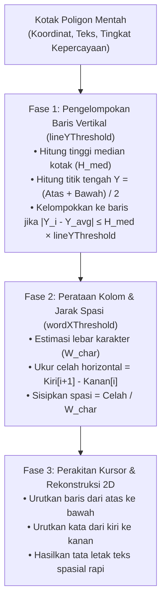

Mesin OCR konvensional umumnya hanya mengembalikan daftar kotak pembatas teks yang terputus-putus, sehingga struktur tabel, celah kolom, dan indentasi baris menjadi hilang.

RustO! menyertakan **Mesin Rekonstruksi Tata Letak Spasial** bawaan yang menganalisis relasi geometri 2D untuk menghasilkan teks yang terformat dan rata secara visual.

## 🎯 Cara Kerja Algoritma



---

## Perbandingan Visual: Mode Keluaran

Sebagai gambaran faktur belanja dengan dua baris barang dan dua kolom:

### 1. Daftar Baris Teks Datar (`output: "lines"`)

```text
Deskripsi Barang
Jumlah
Kopi Latte
Rp28.000
Croissant
Rp22.000
Total
Rp50.000
```

_(Perhatikan bahwa relasi kolom hilang menjadi satu urutan vertikal datar)._

### 2. Teks Rekonstruksi Spasial (`output: "spatial"`)

```text
Deskripsi Barang                               Jumlah
Kopi Latte                                   Rp28.000
Croissant                                    Rp22.000
─────────────────────────────────────────────────────
Total                                        Rp50.000
```

_(Judul kolom, rincian barang, dan baris total tetap rata sesuai posisi 2D aslinya)._

---

## ⚙️ Penyesuaian Parameter Spasial

Rekonstruksi spasial dapat disesuaikan saat runtime melalui `OcrRunOptions`:

```rust
let options = OcrRunOptions {
    output: OutputGranularity::Spatial,
    line_y_threshold: Some(0.5), // Toleransi pengelompokan baris vertikal
    word_x_threshold: Some(0.4), // Toleransi pemisahan kata & kolom horizontal
    ..Default::default()
};
```

### Panduan Penyesuaian Nilai Parameter

| Parameter            | Nilai Default | Kapan Perlu Menaikkan Nilai                                                                                              | Kapan Perlu Menurunkan Nilai                                                               |
| -------------------- | ------------- | ------------------------------------------------------------------------------------------------------------------------ | ------------------------------------------------------------------------------------------ |
| **`lineYThreshold`** | `0.5`         | Naikkan (`0.7` - `0.9`) jika baris struk yang sedikit bergelombang atau miring terpecah menjadi beberapa baris terpisah. | Turunkan (`0.2` - `0.35`) untuk lembar kerja padat atau tabel berbaris rapat.              |
| **`wordXThreshold`** | `0.4`         | Naikkan (`0.6` - `0.8`) untuk menggabungkan kata dengan spasi lebar menjadi satu frasa utuh.                             | Turunkan (`0.2` - `0.3`) untuk menjaga batas kolom data tabel tetap terpisah dengan tegas. |

---

## 💡 Contoh Praktis di Berbagai Platform

### Pada Rust

```rust
let spatial_text = match ocr.detect_text(&image_source, &OcrRunOptions {
    output: OutputGranularity::Spatial,
    line_y_threshold: Some(0.5),
    word_x_threshold: Some(0.4),
    ..Default::default()
})? {
    DetectTextResult::Spatial(text) => text,
    _ => unreachable!(),
};
println!("{spatial_text}");
```

### Pada React Native

```typescript
const formattedLayout = await detectText(
  { uri: 'file:///path/to/invoice.jpg' },
  {
    output: 'spatial',
    lineYThreshold: 0.5,
    wordXThreshold: 0.4,
  }
);
console.log(formattedLayout);
```
