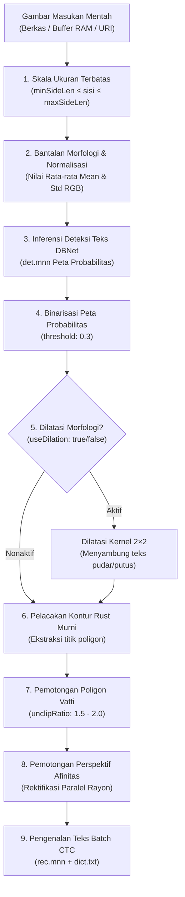

RustO! memberikan kontrol terperinci pada tingkat permintaan (_request-local_) terhadap skala ukuran gambar, ambang batas detektor DBNet, operator morfologi, dan pemotongan poligon.

## 🛠️ Alur Lengkap Pra-pemrosesan



---

## 🎛️ Referensi Parameter

Seluruh parameter dapat dikonfigurasi per panggilan deteksi di dalam `OcrRunOptions`:

```typescript
const options = {
  // 1. Batas Penskalaan Gambar
  minSideLen: 64, // Batas sisi minimum (piksel)
  maxSideLen: 1600, // Batas sisi maksimum (piksel) - mencegah OOM pada foto 48MP
  minHeight: 32, // Batas tinggi minimum
  widthHeightRatio: -1, // -1 mempertahankan rasio aspek asli

  // 2. Penyetelan Detektor DBNet
  detection: {
    limitSideLen: 960, // Target dimensi penskalaan detektor
    limitType: 'max', // 'min' (perbesar teks kecil) atau 'max' (batasi foto besar)
    mean: [0.485, 0.456, 0.406],
    std: [0.229, 0.224, 0.225],
  },

  // 3. Pascapemrosesan Poligon & Binarisasi
  postprocess: {
    threshold: 0.3, // Ambang probabilitas binarisasi piksel (0.0 hingga 1.0)
    boxThreshold: 0.6, // Ambang kepercayaan poligon teks (0.0 hingga 1.0)
    maxCandidates: 1000, // Jumlah maksimum kandidat poligon
    unclipRatio: 2.0, // Faktor ekspansi batas poligon
    useDilation: true, // Dilatasi morfologi 2x2 untuk teks pudar/terputus
  },
};
```

---

## 💡 Lembar Praktis Optimasi Kasus Nyata

### 1. Struk Termal Pudar & Cetakan Dot-Matrix

Kertas termal dan cetakan dot-matrix sering memiliki goresan karakter yang terputus-putus:

```typescript
const faintReceiptOptions = {
  textScore: 0.45,
  postprocess: {
    useDilation: true, // Menyambungkan kembali goresan karakter yang terputus
    threshold: 0.25, // Menurunkan ambang binarisasi untuk cetakan abu-abu terang
    unclipRatio: 2.2, // Memperluas area kotak teks
  },
};
```

### 2. Foto Kamera Ponsel Resolusi Tinggi (48MP - 108MP)

Foto kamera mentah berukuran raksasa dapat menghabiskan memori jika tidak dibatasi sebelum inferensi:

```typescript
const mobileCameraOptions = {
  maxSideLen: 1600, // Menurunkan skala sebelum alokasi memori inferensi
  detection: {
    limitSideLen: 960,
    limitType: 'max',
  },
};
```

### 3. Pemindaian Dokumen Teks Kecil & Padat (Kontrak / Tabel Rapat)

Memastikan teks berukuran 6pt/8pt tetap tajam dan terbaca jelas oleh detektor:

```typescript
const denseScanOptions = {
  detection: {
    limitSideLen: 1200,
    limitType: 'min', // Menaikkan sisi terpendek agar karakter kecil terlihat jelas
  },
  postprocess: {
    useDilation: false, // Mencegah karakter yang berdekatan saling bertumpuk
    unclipRatio: 1.6,
  },
};
```
