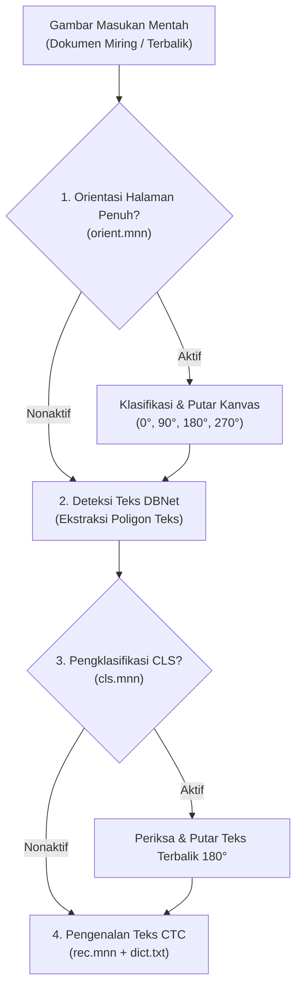

Foto kamera ponsel dan hasil pemindaian sering kali memiliki kemiringan sudut, posisi dokumen terbalik, atau arah teks yang beragam.

RustO! menyediakan dua tahapan koreksi orientasi yang terpisah:



---

## 1. Pengklasifikasi Arah Baris Teks (CLS)

Model CLS mengevaluasi setiap potongan gambar kotak teks yang dihasilkan oleh detektor DBNet. Jika baris teks terdeteksi terbalik (rotasi 180°), model akan memutarnya kembali ke posisi tegak sebelum diserahkan ke pengenal teks CTC.

> [!NOTE]
> Klasifikasi arah baris teks (`cls.mnn`) didukung pada model **PP-OCRv4** dan **PP-OCRv5**. Model PP-OCRv6 telah menggunakan jaringan pengenalan yang kebal terhadap variasi orientasi.

### Konfigurasi Inisialisasi

```rust
use rusto::InitializeConfig;

// Inisialisasi mesin dan sertakan model CLS dengan ambang kepercayaan 0.9
let config = InitializeConfig::ppv5("models/det.mnn", "models/rec.mnn", "models/dict.txt")
    .with_cls_threshold("models/cls.mnn", 0.9);

let mut ocr = RustO::initialize(config)?;
```

### Aktivasi per Permintaan

Aktifkan evaluasi CLS untuk pemindaian tertentu via `OcrRunOptions`:

```rust
let options = OcrRunOptions {
    classification: Some(true), // Mengaktifkan evaluasi CLS untuk pemindaian ini
    ..Default::default()
};
```

---

## 2. Pengklasifikasi Orientasi Halaman Penuh

Untuk dokumen yang difoto miring ke samping (90° / 270°) atau terbalik sepenuhnya (180°):

```rust
let config = InitializeConfig::ppv5("models/det.mnn", "models/rec.mnn", "models/dict.txt")
    .with_orientation_threshold("models/orient.mnn", 0.85);

let mut ocr = RustO::initialize(config)?;
```

### Aktivasi per Permintaan

```rust
let options = OcrRunOptions {
    orientation: Some(true), // Mengklasifikasi & memutar seluruh halaman sebelum deteksi
    ..Default::default()
};
```

---

## 📱 Contoh Lintas Platform (React Native)

```typescript
import { detectText, initialize } from 'react-native-rusto';

// Inisialisasi dengan referensi model
await initialize({
  preset: 'ppv5',
  models: {
    detection: 'det.mnn',
    recognition: 'rec.mnn',
    dictionary: 'dict.txt',
    classification: 'cls.mnn',
    orientation: 'orient.mnn',
  },
});

// Aktifkan koreksi orientasi saat dibutuhkan
const results = await detectText(
  { uri: 'file:///path/to/sideways_document.jpg' },
  {
    orientation: true, // Memperbaiki rotasi 90°/270° halaman penuh
    classification: true, // Memperbaiki baris teks terbalik 180°
  }
);
```
