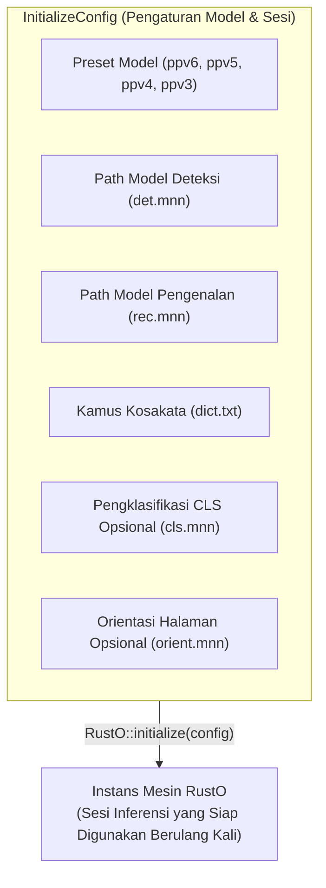

`InitializeConfig` mengonfigurasi berkas model, kamus kosakata, dan jaringan inferensi tambahan untuk menginisialisasi sesi mesin OCR yang siap digunakan berulang kali.

## Kontrak Arsitektur



---

## Skema Wire JSON Kanonikal

Untuk C FFI, JNI, dan serialisasi JSON pada binding independen:

```json
{
  "template": "ppv6",
  "detection": {
    "modelPath": "models/det.mnn",
    "thresh": 0.3,
    "boxThresh": 0.6,
    "unclipRatio": 2.0,
    "limitSideLen": 736,
    "limitType": "min",
    "useDilation": true
  },
  "recognition": {
    "modelPath": "models/rec.mnn",
    "dictPath": "models/dict.txt"
  },
  "classification": {
    "enabled": true,
    "modelPath": "models/cls.mnn",
    "thresh": 0.9
  },
  "orientation": {
    "enabled": true,
    "modelPath": "models/orient.mnn",
    "thresh": 0.85
  }
}
```

---

## Referensi Preset

| Preset           | Default Skala Detektor | Default Mode Skala | Default Rasio Unclip | Arsitektur yang Kompatibel     |
| ---------------- | ---------------------- | ------------------ | -------------------- | ------------------------------ |
| `ppv6` (Default) | `736`                  | `min`              | `2.0`                | PP-OCRv6 (Tiny, Small, Medium) |
| `ppv5`           | `736`                  | `min`              | `2.0`                | PP-OCRv5 (Mobile, Server)      |
| `ppv4`           | `960`                  | `max`              | `1.5`                | PP-OCRv4 (Mobile, Server)      |
| `ppv3`           | `960`                  | `max`              | `1.5`                | PP-OCRv3                       |

---

## API Publik di Seluruh Binding

### Pada Rust

```rust
use rusto::{InitializeConfig, RustO};

// Metode 1: Konstruktor dengan preset default PP-OCRv6
let config = InitializeConfig::ppv6("det.mnn", "rec.mnn", "dict.txt")
    .with_det_thresh(0.3)
    .with_det_box_thresh(0.6)
    .with_unclip_ratio(2.0)
    .with_use_dilation(true)
    .with_cls_threshold("cls.mnn", 0.9)
    .with_orientation_threshold("orient.mnn", 0.85);

let mut ocr = RustO::initialize(config)?;
```

### Pada .NET / C#

```csharp
using RustODotnet;

var config = new InitializeConfig
{
    Template = "ppv6",
    Detection = new DetectionConfig { ModelPath = "det.mnn" },
    Recognition = new RecognitionConfig { ModelPath = "rec.mnn", DictPath = "dict.txt" },
    Classification = new ClassificationConfig { Enabled = true, ModelPath = "cls.mnn", Thresh = 0.9f },
    Orientation = new OrientationConfig { Enabled = true, ModelPath = "orient.mnn", Thresh = 0.85f }
};

using var ocr = RustO.Initialize(config);
```

### Pada iOS (Swift)

```swift
import RustO

let config = InitializeConfig(
    template: "ppv6",
    detection: DetectionConfig(modelPath: "det.mnn"),
    recognition: RecognitionConfig(modelPath: "rec.mnn", dictPath: "dict.txt"),
    classification: ClassificationConfig(enabled: true, modelPath: "cls.mnn", thresh: 0.9),
    orientation: OrientationConfig(enabled: true, modelPath: "orient.mnn", thresh: 0.85)
)

let ocr = try RustO.initialize(config: config)
```

### Pada Android (Kotlin)

```kotlin
import com.byrizki.rusto.*

val config = InitializeConfig(
    template = "ppv6",
    detection = DetectionConfig(modelPath = "det.mnn"),
    recognition = RecognitionConfig(modelPath = "rec.mnn", dictPath = "dict.txt"),
    classification = ClassificationConfig(enabled = true, modelPath = "cls.mnn", thresh = 0.9f),
    orientation = OrientationConfig(enabled = true, modelPath = "orient.mnn", thresh = 0.85f)
)

val ocr = RustO.initialize(context, config)
```

### Pada React Native

```typescript
import { initialize } from 'react-native-rusto';

await initialize({
  preset: 'ppv6',
  models: {
    detection: 'det.mnn',
    recognition: 'rec.mnn',
    dictionary: 'dict.txt',
    classification: 'cls.mnn',
    orientation: 'orient.mnn',
  },
});
```

### Pada C FFI

```c
#include "librusto.h"

const char *config_json = "{\"template\":\"ppv6\",\"detection\":{\"modelPath\":\"det.mnn\"},\"recognition\":{\"modelPath\":\"rec.mnn\",\"dictPath\":\"dict.txt\"}}";
ROCRHandle *handle = rocr_initialize(config_json);

// Dealokasi saat selesai:
rocr_free(handle);
```
