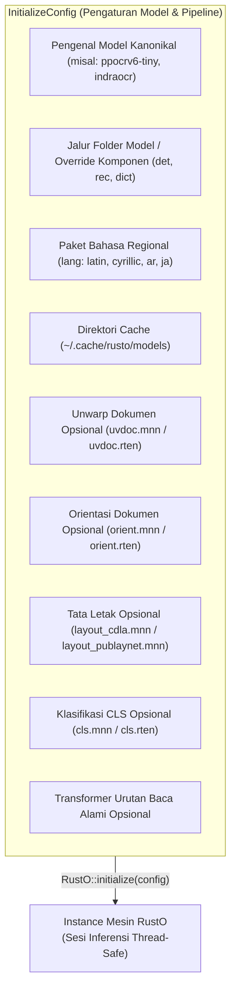

`InitializeConfig` mengonfigurasi pengenal model kanonikal, folder model, kamus karakter, dan jaringan tambahan untuk menginisialisasi sesi mesin OCR yang dapat digunakan kembali.

## Kontrak Arsitektur


```mermaid
flowchart TD
    subgraph Config ["InitializeConfig (Pengaturan Model & Pipeline)"]
        M["Pengenal Model Kanonikal (misal: ppocrv6-tiny, indraocr)"]
        MP["Jalur Folder Model / Override Komponen (det, rec, dict)"]
        L["Paket Bahasa Regional (lang: latin, cyrillic, ar, ja)"]
        CD["Direktori Cache (~/.cache/rusto/models)"]
        U["Unwarp Dokumen Opsional (uvdoc.mnn / uvdoc.rten)"]
        O["Orientasi Dokumen Opsional (orient.mnn / orient.rten)"]
        LAY["Tata Letak Opsional (layout_cdla.mnn / layout_publaynet.mnn)"]
        C["Klasifikasi CLS Opsional (cls.mnn / cls.rten)"]
        RO["Transformer Urutan Baca Alami Opsional"]
    end

    Config -->|"RustO::initialize(config)"| Engine["Instance Mesin RustO<br/>(Sesi Inferensi Thread-Safe)"]
```

---

## Skema Wire Kanonikal

Untuk C FFI, JNI, dan serialisasi JSON lintas bahasa:

```json
{
  "model": "ppocrv6-tiny",
  "modelPath": "models/custom",
  "lang": "latin",
  "cacheDir": "~/.cache/rusto/models",
  "enableReadingOrder": true,
  "layoutVariant": "cdla",
  "detection": {
    "modelPath": "models/custom/det.mnn",
    "thresh": 0.3,
    "boxThresh": 0.6,
    "unclipRatio": 2.0,
    "limitSideLen": 736,
    "limitType": "min",
    "useDilation": false
  },
  "recognition": {
    "modelPath": "models/custom/rec.mnn",
    "dictPath": "models/custom/dict.txt",
    "recBatchNum": 6
  },
  "classification": {
    "enabled": true,
    "modelPath": "models/cls.mnn",
    "thresh": 0.9
  },
  "orientation": {
    "enabled": true,
    "modelPath": "models/orient.mnn",
    "thresh": 0.85
  },
  "unwarp": {
    "enabled": true,
    "modelPath": "models/uvdoc.mnn"
  },
  "layout": {
    "enabled": true,
    "modelPath": "models/layout_cdla.mnn",
    "confThresh": 0.5,
    "targetSize": 800
  }
}
```

---

## Referensi Kolom Konfigurasi

| Kolom                                         | Tipe      | Nilai Bawaan            | Deskripsi                                                                                                                                                                                                         |
| :-------------------------------------------- | :-------- | :---------------------- | :---------------------------------------------------------------------------------------------------------------------------------------------------------------------------------------------------------------- |
| `model`                                       | `string`  | `"ppocrv6-tiny"`        | Pengenal model kanonikal (`ppocrv6-tiny`, `ppocrv6-tiny-fp16`, `ppocrv6-tiny-int8`, `ppocrv6-small`, `ppocrv6-small-int8`, `ppocrv6-medium`, `ppocrv6-medium-int8`, `indraocr`, `ppocrv5`, `ppocrv4`, `ppocrv3`). |
| `modelPath` / `model_path`                    | `string`  | Tidak Ada               | Jalur direktori dasar yang memuat berkas `det` (`.mnn`/`.rten`), `rec`, dan `dict` / `meta.json`.                                                                                                                 |
| `lang`                                        | `string`  | Tidak Ada               | Kode paket bahasa regional (`latin`, `cyrillic`, `ar`, `ja`, `ko`, `devanagari`, dll.).                                                                                                                           |
| `cacheDir` / `cache_dir`                      | `string`  | `~/.cache/rusto/models` | Direktori cache kustom untuk model yang diunduh secara otomatis.                                                                                                                                                  |
| `enableReadingOrder` / `enable_reading_order` | `boolean` | `false`                 | Mengaktifkan transformer pemulihan urutan baca alami dokumen.                                                                                                                                                     |
| `layoutVariant` / `layout_variant`            | `string`  | `"cdla"`                | Varian tata letak dokumen: `"cdla"` (10 kelas) atau `"publaynet"` (5 kelas).                                                                                                                                      |
| `detection`                                   | `object`  | Opsional                | Konfigurasi model deteksi eksplisit dan parameter override.                                                                                                                                                       |
| `recognition`                                 | `object`  | Opsional                | Konfigurasi model pengenalan eksplisit, kamus kosakata, dan ukuran batch.                                                                                                                                         |
| `classification`                              | `object`  | Opsional                | Konfigurasi klasifikasi inversi sudut baris teks 180°.                                                                                                                                                            |
| `orientation`                                 | `object`  | Opsional                | Konfigurasi klasifikasi orientasi dokumen penuh 0°/90°/180°/270°.                                                                                                                                                 |
| `unwarp`                                      | `object`  | Opsional                | Konfigurasi jaringan unwarping geometris lipatan dokumen.                                                                                                                                                         |
| `layout`                                      | `object`  | Opsional                | Konfigurasi jaringan analisis tata letak dokumen.                                                                                                                                                                 |

---

## Contoh API di Berbagai Bahasa Pemrograman

### Rust

```rust
use rusto::{InitializeConfig, RustO};

// Metode 1: Menggunakan nama model kanonikal dengan auto-download dan cache
let config = InitializeConfig::from_json(r#"{
    "model": "ppocrv6-tiny",
    "lang": "latin"
}"#)?;
let mut ocr = RustO::initialize(config)?;

// Metode 2: Jalur eksplisit menggunakan pembuat builder (.mnn atau .rten)
let config = InitializeConfig::ppv6("models/det.mnn", "models/rec.mnn", "models/dict.txt")
    .with_det_thresh(0.3)
    .with_unwarp("models/uvdoc.mnn")
    .with_orientation_threshold("models/orient.mnn", 0.85);

let mut ocr = RustO::initialize(config)?;
```

### TypeScript / Node.js

```typescript
import { RustO } from '@rustors/node';

// Unduh aset model sebelumnya
RustO.downloadModel('ppocrv6-tiny', 'latin');

// Inisialisasi dengan model kanonikal
const ocr = RustO.initialize({
  model: 'ppocrv6-tiny',
  modelPath: '/path/to/custom/models', // folder lokal opsional
  lang: 'latin',
});
```

### Python

```python
from rusto import RustO, InitializeConfig, create_initialize_config_for_model, download_model

# Unduh model sebelumnya
download_model(model="ppocrv6-tiny", lang="latin")

# Inisialisasi menggunakan helper berorientasi tipe
config = create_initialize_config_for_model(model="ppocrv6-tiny", lang="latin")
engine = RustO.initialize(config)
```

### .NET / C#

```csharp
using RustODotnet;

// Unduh model sebelumnya
RustO.DownloadModel("ppocrv6-tiny", "latin");

// Inisialisasi menggunakan factory helper
var config = InitializeConfig.ForModel("ppocrv6-tiny", lang: "latin", modelPath: "models/custom");
using var ocr = RustO.Initialize(config);
```

### iOS (Swift)

```swift
import RustO

// Unduh model sebelumnya
try RustO.downloadModel(model: "ppocrv6-tiny", lang: "latin")

// Inisialisasi dengan model kanonikal
let config = InitializeConfig(
    model: "ppocrv6-tiny",
    modelPath: "/path/to/models",
    lang: "latin"
)
let ocr = try RustO.initialize(config: config)
```

### Android (Kotlin)

```kotlin
import com.byrizki.rusto.RustO
import com.byrizki.rusto.InitializeConfig

// Unduh model sebelumnya
RustO.downloadModel(model = "ppocrv6-tiny", lang = "latin")

// Inisialisasi dengan model kanonikal
val config = InitializeConfig(
    model = "ppocrv6-tiny",
    modelPath = "/sdcard/models",
    lang = "latin"
)
val ocr = RustO.initialize(context, config)
```

### React Native

```typescript
import { initialize } from '@rustors/react-native';

await initialize({
  model: 'ppocrv6-tiny',
  modelPath: 'models/custom',
  lang: 'latin',
  enableReadingOrder: true,
  layoutVariant: 'cdla',
});
```

### Dart / Flutter

```dart
import 'package:rusto/rusto.dart';

// Unduh model sebelumnya
RustO.downloadModel(model: 'ppocrv6-tiny', lang: 'latin');

// Inisialisasi dengan model kanonikal
final config = createInitializeConfigForModel('ppocrv6-tiny', 'latin', '/path/to/models');
final ocr = RustO.initialize(config);
```

### C FFI

```c
#include "rusto.h"

const char *config_json = "{\"model\":\"ppocrv6-tiny\",\"lang\":\"latin\"}";
ROCRHandle *handle = rocr_initialize(config_json);

// Setelah selesai:
rocr_free(handle);
```
