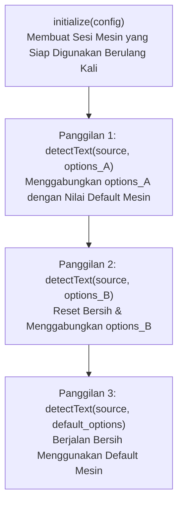

`OcrRunOptions` (`DetectTextOptions` pada React Native) mengonfigurasi parameter runtime untuk setiap eksekusi OCR individual. Opsi ini berlaku untuk satu pemanggilan `detectText` tanpa mengubah sesi model yang telah diinisialisasi.



---

## Skema Wire JSON Kanonikal

```json
{
  "output": "lines",
  "lineYThreshold": 0.5,
  "wordXThreshold": 0.4,
  "textScore": 0.5,
  "classification": false,
  "orientation": false,
  "minHeight": 32,
  "maxSideLen": 1600,
  "minSideLen": 64,
  "widthHeightRatio": -1,
  "detection": {
    "limitSideLen": 960,
    "limitType": "max",
    "mean": [0.485, 0.456, 0.406],
    "std": [0.229, 0.224, 0.225]
  },
  "postprocess": {
    "threshold": 0.3,
    "boxThreshold": 0.6,
    "maxCandidates": 1000,
    "unclipRatio": 2.0,
    "useDilation": true
  }
}
```

---

## Spesifikasi Parameter

### 1. Kontrol Mode Keluaran & Pengelompokan

| Opsi             | Tipe              | Nilai Default        | Rentang Nilai Valid         | Deskripsi                                                                  |
| ---------------- | ----------------- | -------------------- | --------------------------- | -------------------------------------------------------------------------- |
| `output`         | `string` / `enum` | `lines`              | `lines`, `words`, `spatial` | Memilih baris terstruktur, per kata, atau tata letak spasial.              |
| `lineYThreshold` | `float`           | `0.5`                | `>= 0.0`                    | Pengali toleransi vertikal untuk mengelompokkan kotak menjadi baris.       |
| `wordXThreshold` | `float`           | `0.4`                | `>= 0.0`                    | Pengali lebar karakter untuk perataan kolom dan jarak antar kata.          |
| `textScore`      | `float`           | Preset Mesin (`0.5`) | `0.0 .. 1.0`                | Batas minimum skor kepercayaan pengenalan teks.                            |
| `classification` | `boolean`         | `false`              | `true`, `false`             | Mengevaluasi pengklasifikasi baris teks 180° (perlu model CLS).            |
| `orientation`    | `boolean`         | `false`              | `true`, `false`             | Mengevaluasi pengklasifikasi orientasi halaman penuh (perlu model Orient). |

---

### 2. Batas & Penskalaan Gambar

| Opsi               | Tipe    | Nilai Default | Rentang Nilai Valid        | Deskripsi                                                         |
| ------------------ | ------- | ------------- | -------------------------- | ----------------------------------------------------------------- |
| `minSideLen`       | `float` | `64.0`        | `> 0.0`                    | Batas panjang sisi minimum gambar saat diskalakan.                |
| `maxSideLen`       | `float` | `1600.0`      | `minSideLen <= maxSideLen` | Batas panjang sisi maksimum gambar (mencegah OOM pada foto 48MP). |
| `minHeight`        | `float` | `32.0`        | `> 0.0`                    | Tinggi vertikal minimum untuk bantalan morfologi (_padding_).     |
| `widthHeightRatio` | `float` | `-1.0`        | `> 0.0` atau `-1.0`        | Rasio aspek bantalan pengenalan. `-1` mempertahankan rasio asli.  |

---

### 3. Penyetelan Masukan Detektor (`detection`)

| Opsi           | Tipe       | Nilai Default           | Rentang Nilai Valid | Deskripsi                                                      |
| -------------- | ---------- | ----------------------- | ------------------- | -------------------------------------------------------------- |
| `limitSideLen` | `integer`  | Preset (`736` / `960`)  | `1 .. 32767`        | Target dimensi penskalaan masukan untuk detektor DBNet.        |
| `limitType`    | `string`   | Preset (`min` / `max`)  | `min`, `max`        | `min`: perbesar sisi terpendek. `max`: batasi sisi terpanjang. |
| `mean`         | `float[3]` | `[0.485, 0.456, 0.406]` | 3 angka berhingga   | Nilai rata-rata (_mean_) normalisasi kanal warna RGB.          |
| `std`          | `float[3]` | `[0.229, 0.224, 0.225]` | 3 angka bukan nol   | Standar deviasi (_std_) normalisasi kanal warna RGB.           |

---

### 4. Pascapemrosesan Detektor (`postprocess`)

| Opsi            | Tipe      | Nilai Default             | Rentang Nilai Valid | Deskripsi                                                           |
| --------------- | --------- | ------------------------- | ------------------- | ------------------------------------------------------------------- |
| `threshold`     | `float`   | Preset (`0.3`)            | `0.0 .. 1.0`        | Ambang probabilitas binarisasi piksel.                              |
| `boxThreshold`  | `float`   | Preset (`0.6` / `0.5`)    | `0.0 .. 1.0`        | Ambang batas skor kepercayaan rata-rata poligon kandidat teks.      |
| `maxCandidates` | `integer` | `1000`                    | `>= 1`              | Jumlah maksimum kontur poligon yang dipertahankan.                  |
| `unclipRatio`   | `float`   | Preset (`2.0` / `1.5`)    | `> 0.0`             | Rasio ekspansi poligon Vatti untuk menangkap seluruh goresan huruf. |
| `useDilation`   | `boolean` | Preset (`true` / `false`) | `true`, `false`     | Menerapkan dilatasi morfologi 2×2 untuk teks redup/putus.           |

---

## Contoh di Berbagai Bahasa

### Pada Rust

```rust
use rusto::{DetectionRunOptions, OcrRunOptions, OutputGranularity, PostprocessRunOptions};

let options = OcrRunOptions {
    output: OutputGranularity::Words,
    text_score: Some(0.55),
    line_y_threshold: Some(0.5),
    word_x_threshold: Some(0.4),
    max_side_len: Some(1600.0),
    detection: Some(DetectionRunOptions {
        limit_side_len: Some(960),
        limit_type: Some("max".into()),
        ..Default::default()
    }),
    postprocess: Some(PostprocessRunOptions {
        use_dilation: Some(true),
        unclip_ratio: Some(2.0),
        ..Default::default()
    }),
    ..Default::default()
};
```

### Pada .NET / C#

```csharp
using RustODotnet;

var options = new OcrRunOptions
{
    Output = OutputGranularity.Words,
    TextScore = 0.55f,
    LineYThreshold = 0.5f,
    WordXThreshold = 0.4f,
    MaxSideLen = 1600f,
    Detection = new DetectionRunOptions
    {
        LimitSideLen = 960,
        LimitType = "max"
    },
    Postprocess = new PostprocessRunOptions
    {
        UseDilation = true,
        UnclipRatio = 2.0f
    }
};
```

### Pada Swift (iOS)

```swift
import RustO

let options = OcrRunOptions(
    output: .words,
    lineYThreshold: 0.5,
    wordXThreshold: 0.4,
    textScore: 0.55,
    maxSideLen: 1600,
    detection: DetectionRunOptions(limitSideLen: 960, limitType: "max"),
    postprocess: PostprocessRunOptions(useDilation: true, unclipRatio: 2.0)
)
```

### Pada Kotlin (Android)

```kotlin
import com.byrizki.rusto.*

val options = OcrRunOptions(
    output = OutputGranularity.WORDS,
    lineYThreshold = 0.5f,
    wordXThreshold = 0.4f,
    textScore = 0.55f,
    maxSideLen = 1600f,
    detection = DetectionRunOptions(limitSideLen: 960, limitType = "max"),
    postprocess = PostprocessRunOptions(useDilation = true, unclipRatio = 2.0f)
)
```

### Pada React Native

```typescript
import { DetectTextOptions } from 'react-native-rusto';

const options: DetectTextOptions = {
  output: 'words',
  lineYThreshold: 0.5,
  wordXThreshold: 0.4,
  textScore: 0.55,
  maxSideLen: 1600,
  detection: {
    limitSideLen: 960,
    limitType: 'max',
  },
  postprocess: {
    useDilation: true,
    unclipRatio: 2.0,
  },
};
```
