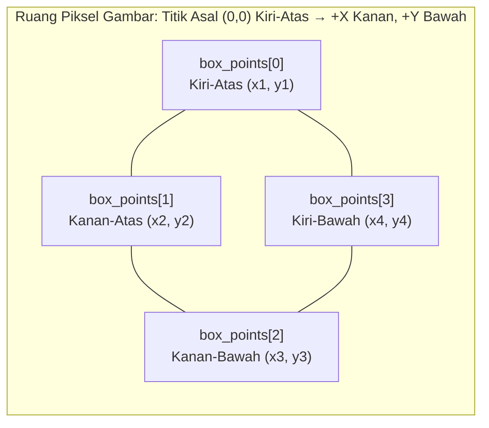

Setiap eksekusi deteksi OCR memproses satu `ImageSource` dan menghasilkan blok pembatas terstruktur atau teks tata letak spasial yang direkonstruksi.

## 📥 Sumber Gambar Masukan

| Binding          | Sumber Berkas / URI          | Sumber Buffer Memori RAM                          | Catatan                                                          |
| ---------------- | ---------------------------- | ------------------------------------------------- | ---------------------------------------------------------------- |
| **Rust**         | `ImageSource::Path(PathBuf)` | `ImageSource::Bytes(Vec<u8>)`                     | Dekode byte memori menggunakan mesin `image` Rust murni.         |
| **.NET**         | `UriImageSource(string)`     | `BytesImageSource(byte[])`                        | Menerima path berkas sistem atau URI `file:`.                    |
| **Swift**        | `.uri(String)`               | `.bytes(Data)`                                    | Menerima path berkas atau string URL berkas.                     |
| **Kotlin**       | `ImageSource.Uri(String)`    | `ImageSource.Bytes(ByteArray)`                    | Mengurai URI `content://` Android dan `file://` secara otomatis. |
| **React Native** | `{ uri: string }`            | `{ base64: string }` atau `{ bytes: Uint8Array }` | Wajib memuat tepat satu properti dalam objek masukan.            |

---

## 📐 Ruang Koordinat & Geometri

Koordinat dinyatakan dalam satuan piksel gambar terhadap titik asal kiri-atas `(0, 0)`:



- **`box_points`**: Tepat 4 titik sudut poligon segiempat: `[Kiri-Atas, Kanan-Atas, Kanan-Bawah, Kiri-Bawah]`. Mengikuti sudut kemiringan teks yang sebenarnya.
- **`frame`**: Kotak batas sejajar sumbu (_axis-aligned bounding rectangle_): `(left, top, width, height)` yang dihitung dari batas terluar poligon.

---

## 📤 Rincian Mode Keluaran

| Mode                  | Bentuk Hasil Kembalian              | Kegunaan                                                                                       |
| --------------------- | ----------------------------------- | ---------------------------------------------------------------------------------------------- |
| **`lines`** (Default) | Daftar Terstruktur (`TextResult[]`) | Membaca dokumen standar, paragraf teks, dan formulir baris per baris.                          |
| **`words`**           | Daftar Terstruktur (`TextResult[]`) | Interaksi klik per kata, penyorotan teks kata per kata, atau visualisasi kotak batas granular. |
| **`spatial`**         | String Teks Biasa (`string`)        | Mempertahankan kolom 2D, perataan tabel, baris struk, dan indentasi dokumen.                   |

---

## 🗂️ Model Data Terstruktur (`TextResult`)

```json
[
  {
    "text": "Total Tagihan",
    "score": 0.992,
    "box_points": [
      [40.0, 120.0],
      [160.0, 120.0],
      [160.0, 148.0],
      [40.0, 148.0]
    ],
    "frame": {
      "left": 40.0,
      "top": 120.0,
      "width": 120.0,
      "height": 28.0
    }
  },
  {
    "text": "Rp2.500.000",
    "score": 0.987,
    "box_points": [
      [280.0, 120.0],
      [380.0, 120.0],
      [380.0, 148.0],
      [280.0, 148.0]
    ],
    "frame": {
      "left": 280.0,
      "top": 120.0,
      "width": 100.0,
      "height": 28.0
    }
  }
]
```

### Pemetaan Tipe Properti Lintas Bahasa

| Konsep           | Rust              | .NET / C#                   | Swift (iOS)      | Kotlin (Android)   | React Native      |
| ---------------- | ----------------- | --------------------------- | ---------------- | ------------------ | ----------------- |
| **Koleksi List** | `Vec<TextResult>` | `IReadOnlyList<TextResult>` | `[TextResult]`   | `List<TextResult>` | `TextResult[]`    |
| **Teks String**  | `item.text`       | `item.Text`                 | `item.text`      | `item.text`        | `item.text`       |
| **Kepercayaan**  | `item.score`      | `item.Score`                | `item.score`     | `item.score`       | `item.score`      |
| **Poligon Quad** | `item.box_points` | `item.BoxPoints`            | `item.boxPoints` | `item.boxPoints`   | `item.box_points` |
| **Frame Kotak**  | `item.frame`      | `item.Frame`                | `item.frame`     | `item.frame`       | `item.frame`      |

---

## 💻 Contoh Penanganan Hasil di Berbagai Bahasa

### Pada Rust

```rust
match ocr.detect_text(&source, &options)? {
    DetectTextResult::Structured(items) => {
        for item in items {
            println!("{} ({:.1}%) di [{}, {}]", item.text, item.score * 100.0, item.frame.left, item.frame.top);
        }
    }
    DetectTextResult::Spatial(spatial_text) => {
        println!("{spatial_text}");
    }
}
```

### Pada .NET / C#

```csharp
var result = ocr.DetectText(source, options);

if (result is StructuredDetectTextResult structured)
{
    foreach (var item in structured.Items)
    {
        Console.WriteLine($"{item.Text} ({item.Score:P0}) [{item.Frame.Left}, {item.Frame.Top}]");
    }
}
else if (result is SpatialDetectTextResult spatial)
{
    Console.WriteLine(spatial.Text);
}
```

### Pada iOS (Swift)

```swift
let result = try ocr.detectText(source, options: options)

switch result {
case .structured(let items):
    for item in items {
        print("\(item.text) (\(item.score)) [\(item.frame.left), \(item.frame.top)]")
    }
case .spatial(let text):
    print(text)
}
```

### Pada Android (Kotlin)

```kotlin
when (val result = ocr.detectText(source, options)) {
    is DetectTextResult.Structured -> {
        result.items.forEach { item ->
            println("${item.text} (${item.score}) [${item.frame.left}, ${item.frame.top}]")
        }
    }
    is DetectTextResult.Spatial -> {
        println(result.text)
    }
}
```

### Pada React Native

```typescript
// Keluaran Lines -> TextResult[]
const lines = await detectText({ uri }, { output: 'lines' });
lines.forEach((item) => console.log(item.text, item.frame));

// Keluaran Spatial -> string
const spatialText = await detectText({ uri }, { output: 'spatial' });
console.log(spatialText);
```
